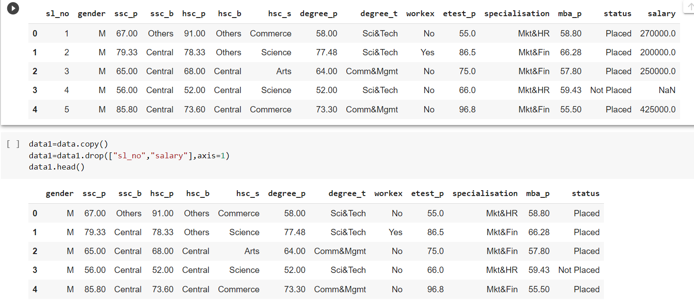
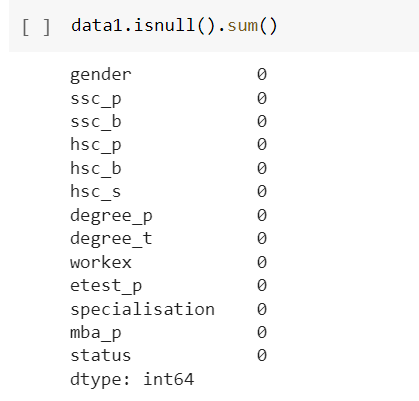
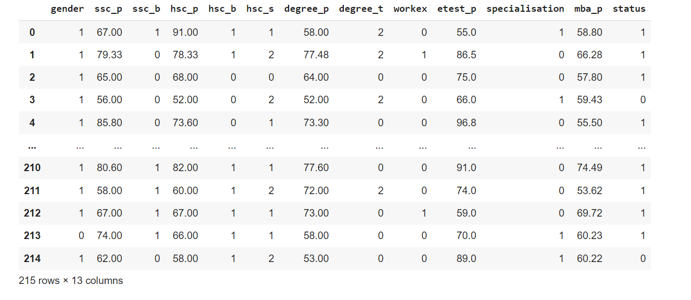
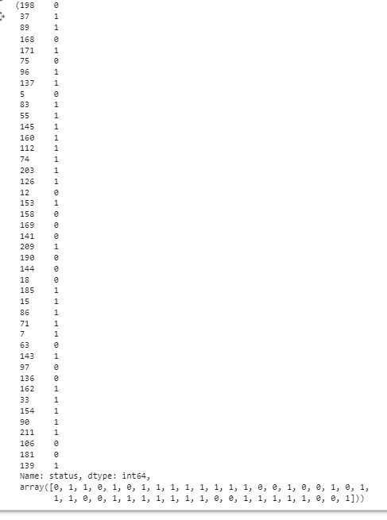

# Implementation-of-Logistic-Regression-Model-to-Predict-the-Placement-Status-of-Student

## AIM:
To write a program to implement the the Logistic Regression Model to Predict the Placement Status of Student.

## Equipments Required:
1. Hardware – PCs
2. Anaconda – Python 3.7 Installation / Jupyter notebook

## Algorithm
1. Import dataset 
2. Check for null and duplicate values
3. Assign x and y values
4. Split the data into training and testing data
5. Import logistic regression and fit the training data
6. Predict y value
7. Calculate accuracy and confusion matrix

## Program:
```
/*
Program to implement the the Logistic Regression Model to Predict the Placement Status of Student.
Developed by: M.Subiksha
RegisterNumber: 212220040162
#LOGISTIC REGRESSION

import pandas as pd
data=pd.read_csv('/content/Placement_Data (1).csv')
data.head()
data1=data.copy()
data1=data1.drop(["sl_no","salary"],axis=1)
data1.head()
data1.isnull().sum()
data1.duplicated().sum()
from sklearn.preprocessing import LabelEncoder
le=LabelEncoder()
data1["gender"]=le.fit_transform(data1["gender"])
data1["ssc_b"]=le.fit_transform(data1["ssc_b"])
data1["hsc_b"]=le.fit_transform(data1["hsc_b"])
data1["hsc_s"]=le.fit_transform(data1["hsc_s"])
data1["degree_t"]=le.fit_transform(data1["degree_t"])
data1["workex"]=le.fit_transform(data1["workex"])
data1["specialisation"]=le.fit_transform(data1["specialisation"])
data1["status"]=le.fit_transform(data1["status"])
data1
x=data1.iloc[:,:-1]
x
y=data1["status"]
y
from sklearn.model_selection import train_test_split
x_train,x_test,y_train,y_test=train_test_split(x,y,test_size=0.2,random_state=0)
from sklearn.linear_model import LogisticRegression
lr=LogisticRegression(solver="liblinear")
lr.fit(x_train,y_train)
y_pred=lr.predict(x_test)
y_pred
from sklearn.metrics import accuracy_score
accuracy=accuracy_score(y_test,y_pred)
from sklearn.metrics import confusion_matrix
confusion=(y_test,y_pred)
confusion

*/
```

## Output:







## Result:
Thus the program to implement the the Logistic Regression Model to Predict the Placement Status of Student is written and verified using python programming.
